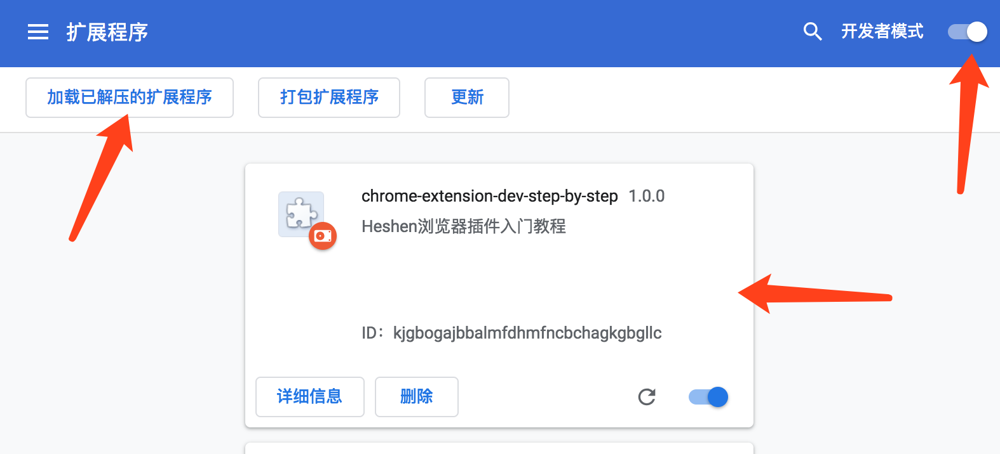

# chrome-extenstion-dev-step-by-step
chrome extension plugin guide step by step，Chrome浏览器扩展开发入门指南，分布教程


项目地址：https://github.com/heshen/chrome-extenstion-dev-step-by-step

博客 http://1985wanggang.blog.163.com
# 说明：
chrome 插件，由浅入深，从最基本的功能开始开发

01
初始功能，没有任何功能，搭建个扩展包的基本架子
最简单，只需要一个manifest.json文件就可以了。

如下即可：
```
{
  // 清单文件的版本，这个必须写，而且必须是2
  "manifest_version": 2,
  // 插件的名称
  "name": "chrome-extension-dev-step-by-step",
  // 插件的版本
  "version": "1.0.0",
  // 插件描述
  "description": "Heshen浏览器插件入门教程"

}
```

浏览器打开扩展程序：
```angular2html
chrome://extensions/
```

打开开发者模式开关，


点击 "加载已解压的扩展程序" 打开文件选择 01目录


浏览器插件加载完，显示如图：



附注：

```angular2html
name 必须属性
```

#### version 必选
```angular2html
Required value 'version' is missing or invalid. It must be between 1-4 dot-separated integers each between 0 and 65536.

```
### "description": "浏览器插件入门教程" 可选
```angular2html
"description": "浏览器插件入门教程"
```


如果是0 会有下面报错
```angular2html
"manifest_version": 0,
```
```angular2html
Invalid value for 'manifest_version'. Must be an integer greater than zero.

```

设置为1
```angular2html
"manifest_version": 1,

```
错误提示如下
```angular2html
chrome-extenstion-dev-step-by-step/01
错误
The 'manifest_version' key must be present and set to 2 (without quotes). See developer.chrome.com/extensions/manifestVersion.html for details.
无法加载清单。
```

实测版本大于2 目前也不会报错，例如：

```angular2html
  "manifest_version": 100,

```
