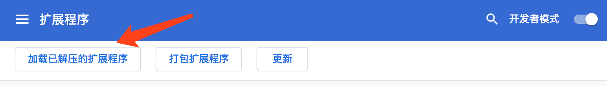

# chrome-extenstion-dev-step-by-step
chrome extension plugin guide step by step，Chrome浏览器扩展开发入门指南，分步教程


项目地址：https://github.com/heshen/chrome-extenstion-dev-step-by-step

博客 http://1985wanggang.blog.163.com
# 说明：
chrome 插件，由浅入深，从最基本的功能开始开发

# 02 
## 添加图标
### 在01的基础上扩展功能
最简单，只需要一个manifest.json文件就可以了。


#### 给扩展插件加一个浏览器右上角的图标
```
  "icons": {
    "16": "img/icon.png",
    "48": "img/icon.png",
    "128": "img/icon.png"
  }
```


浏览器打开扩展程序：
```angular2html
chrome://extensions/
```

打开开发者模式开关，


点击 "加载已解压的扩展程序" 打开文件选择 02目录




浏览器插件加载完，显示如图：


#### 查看扩展插件，默认弹出菜单


#### 新增插件点击弹窗菜单，修改默认菜单
修改manifest.json 新增
```angular2html
"browser_action": {
      "default_popup": "popup.html",
      "default_icon": "popup.png"
 }
```
这里图标使用和前面的不一样，可以看到插件点击图标


这里的弹出框其实就是我们这个插件与用户交互的主要界面，它其实就是一个html页面。不过这个popup.html文件并不需要
```angular2html
<html></html>、<body></body>、<head></head> 
```
这样的标签。
这些省略也没有问题


### 附录
所有的chrome插件都是安装在资源管理库(library)里面的,如果你的记性够好，请记住MAC下插件的安装位置：
```angular2html
~/Library/Application Support/Google/Chrome/Default/Extensions
```
