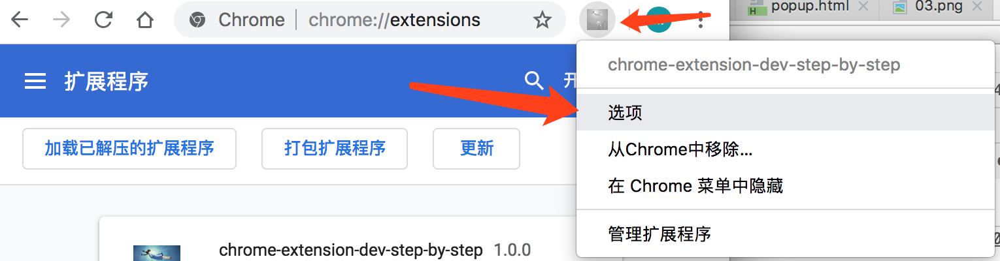
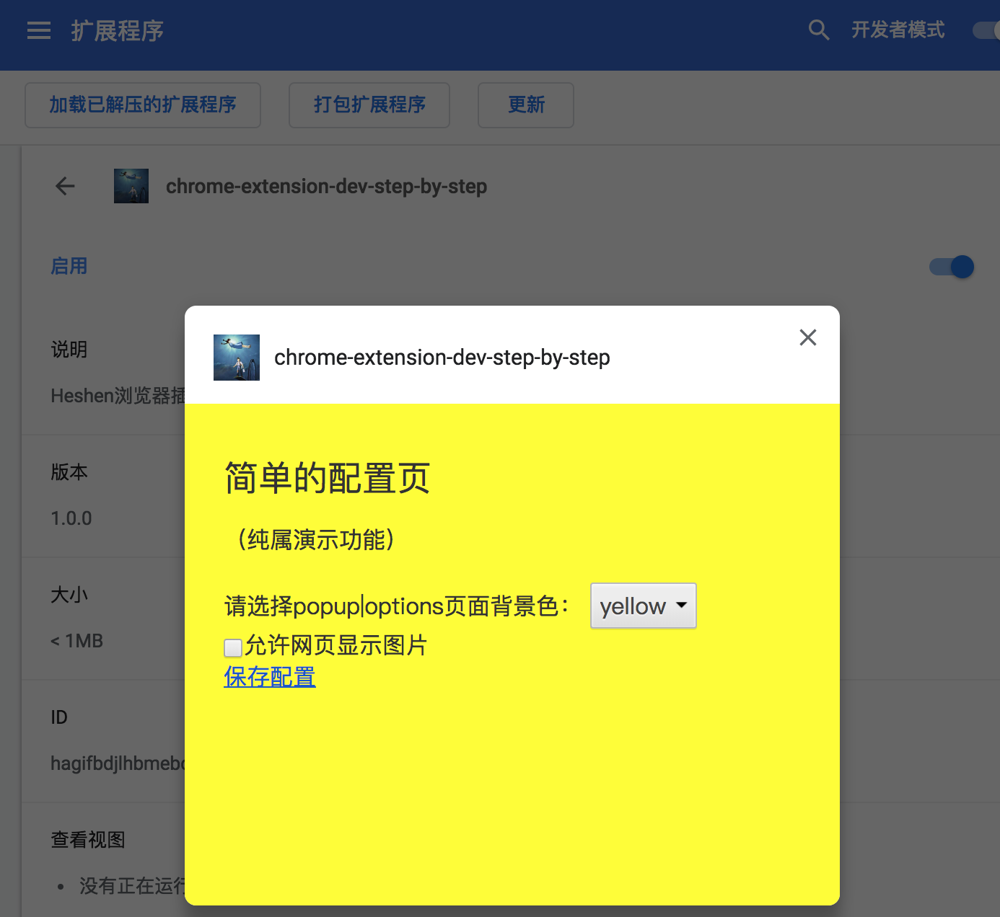

# chrome-extenstion-dev-step-by-step
chrome extension plugin guide step by step，Chrome浏览器扩展开发入门指南，分布教程


项目地址：https://github.com/heshen/chrome-extenstion-dev-step-by-step

博客 http://1985wanggang.blog.163.com
# 说明：
chrome 插件，由浅入深，从最基本的功能开始开发

# 03 
## 增加配置选项
### 在02的基础上扩展功能
同上02，浏览器加载03的扩展

#### manifest.json 注释掉02 的弹窗功能
```
   "browser_action": {
     "default_popup": "popup.html",
     "default_icon": "img/popup.png"
   }
```

#### manifest.json 添加选项配置 
```angular2html
  // Chrome40以前的插件配置页写法
  "options_page": "options.html",
  // Chrome40以后的插件配置页写法，如果2个都写，新版Chrome只认后面这一个
  "options_ui":
  {
    "page": "options.html",
    // 添加一些默认的样式，推荐使用
    "chrome_style": true
  }
```
#### 新增options.html
```angular2html
options.html
options.js

```
options.js 存储，绑定事件等


通过选项打开



### 附录
所有的chrome插件都是安装在资源管理库(library)里面的,如果你的记性够好，请记住MAC下插件的安装位置：
```angular2html
~/Library/Application Support/Google/Chrome/Default/Extensions
```
#### chrome 存储
```
chrome.storage.sync.get，
chrome.storage.sync.set
chrome.storage.local.get
chrome.storage.local.set
```
保存
